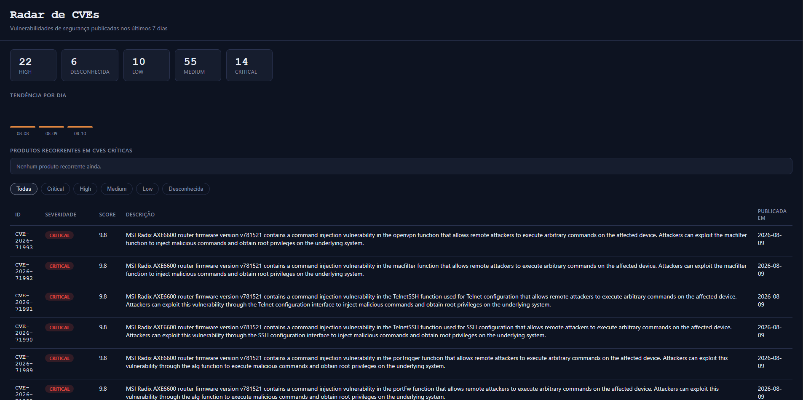

# radar_cve

Painel que monitora vulnerabilidades de segurança (CVEs) publicadas recentemente, direto do NVD (National Vulnerability Database, mantido pelo NIST/governo dos EUA). Usa **Python + SQL** para buscar, limpar e analisar os dados, e **Firebase (plano gratuito Spark)** para guardar um resumo na nuvem e mostrar num site público.

Nenhuma parte deste projeto exige assinar um plano pago.

<!-- Adicione um print do dashboard funcionando aqui, por exemplo: -->
<!--  -->

🔗 **Demo:** https://radar-cve.web.app

## O que o dashboard mostra

- **Resumo por severidade** — cartões com a contagem de CVEs Critical, High, Medium, Low e Desconhecida.
- **Tendência por dia** — gráfico de barras simples mostrando quantas CVEs foram publicadas em cada um dos últimos dias.
- **Produtos recorrentes em CVEs críticas** — lista de produtos que aparecem em mais de uma CVE crítica ao mesmo tempo, útil pra identificar focos de risco.
- **Tabela filtrável** — todas as CVEs coletadas, com filtro por severidade (incluindo "Desconhecida", pra CVEs publicadas mas ainda não totalmente analisadas pelo NVD).

## De onde vêm os dados

As vulnerabilidades não são descobertas por este projeto — elas já foram encontradas e reportadas por pesquisadores de segurança, numeradas por uma CNA (CVE Numbering Authority, como a MITRE ou a própria fabricante do software) e publicadas pelo NVD/NIST. Este projeto **consome** esse feed público continuamente, funcionando como uma ferramenta de monitoramento/inteligência de vulnerabilidades — não como um scanner ativo.

Durante a coleta, o projeto também descarta automaticamente CVEs com status `Rejected` (canceladas oficialmente pela CNA), que a API do NVD ainda devolve, mas que não representam uma vulnerabilidade real.

## Como as peças se encaixam

```
NVD/NIST (feed público)
        │
        ▼
  fetch_cves.py  ──────►  cve_tracker.db (SQLite = "SQL")
        │  (descarta CVEs Rejected)     │
        │                        queries.py
        │                (severidade, tendência por dia,
        │                 produtos recorrentes, JOIN/HAVING)
        │                        │
        ▼                        ▼
  sync_firestore.py  ──────►  Firestore (Firebase, nuvem)
                                    │
                                    ▼
                          public/index.html (site)
                          lido direto pelo navegador da pessoa
```

- **SQLite** guarda os dados completos localmente, e é onde o SQL de verdade acontece (filtros, `JOIN`, `GROUP BY`, `HAVING`).
- **Firestore** guarda só um *resumo* pronto, pensado pro site ler rápido, sem precisar de um backend rodando o tempo todo.
- **Firebase Hosting** publica o site de graça, sem servidor nenhum pra administrar.

## Stack

- **Python** — coleta (`requests`), banco local (`sqlite3`), sincronização (`firebase-admin`)
- **SQL** — filtros, agregações (`GROUP BY`, `COUNT`), junções (`JOIN`), filtro de grupo (`HAVING`)
- **Firebase / Google Cloud Platform** — Firestore (banco na nuvem) e Hosting (site estático), ambos no plano gratuito Spark
- **HTML/CSS/JavaScript** — dashboard, sem framework, lendo o Firestore em tempo real

## Como rodar

### 1. Criar o projeto no Firebase
Crie um projeto em [console.firebase.google.com](https://console.firebase.google.com) (plano Spark, gratuito) e ative o **Firestore Database** em modo de produção.

### 2. Baixar a chave da conta de serviço
Em *Configurações do projeto → Contas de serviço → Gerar nova chave privada*. Renomeie o arquivo baixado para `firebase-service-account.json` e coloque na raiz do projeto (nunca suba esse arquivo pro GitHub — já está no `.gitignore`).

### 3. Configurar o app Web
Em *Configurações do projeto → Seus apps*, registre um app Web e copie o `firebaseConfig` para dentro de `public/app.js`, no lugar dos valores de exemplo.

### 4. Instalar dependências e rodar o pipeline
```bash
pip install -r requirements.txt

cd src
python db.py               # cria as tabelas
python fetch_cves.py       # busca CVEs recentes na internet
python queries.py          # (opcional) testa as queries no terminal
python sync_firestore.py   # envia os resumos pro Firestore
```

### 5. Publicar o site
```bash
npm install -g firebase-tools
firebase login
firebase use --add
firebase deploy --only firestore:rules,hosting
```

### Atualizando os dados depois
```bash
cd src
python fetch_cves.py
python sync_firestore.py
```
Não precisa rodar `firebase deploy` de novo — o site lê do Firestore em tempo real.

## Estrutura de arquivos

```
cve-tracker/
├── database/
│   └── schema.sql            # tabelas: cve, produto_afetado
├── src/
│   ├── db.py                  # conecta e cria o banco SQLite
│   ├── fetch_cves.py          # busca na API do NVD, descarta CVEs rejeitadas
│   ├── queries.py             # severidade, tendência por dia, produtos recorrentes, JOIN/HAVING
│   └── sync_firestore.py      # envia os resumos pro Firestore
├── public/
│   ├── index.html
│   ├── style.css
│   └── app.js                 # lê o Firestore e desenha o dashboard
├── firebase.json
├── firestore.rules            # leitura pública, escrita bloqueada (só o Admin SDK escreve)
├── requirements.txt
└── .gitignore
```

## Limitações conhecidas

- **Janela de 7 dias não é limpa automaticamente**: o `fetch_cves.py` nunca apaga CVEs antigas do SQLite, então dados de mais de 7 dias atrás continuam acumulando no banco (e sendo reenviados pro Firestore) até uma limpeza ser adicionada.
- **Paginação da API**: a API do NVD é consultada com `resultsPerPage: 50` e sem paginação — em dias com mais de 50 CVEs publicadas, algumas podem não ser coletadas.
- **Produtos afetados dependem da análise do NVD**: CVEs recém-publicadas às vezes ainda não têm o campo de produtos preenchido pelo NVD, o que pode deixar "Produtos recorrentes" vazio temporariamente.

## Segurança dos dados

O Firestore fica com leitura pública e escrita bloqueada (`firestore.rules`): qualquer visitante pode ler o painel, mas só o script Python — autenticado com a chave da conta de serviço, que ignora essas regras por ser um acesso administrativo — pode escrever. A configuração do Firebase exposta em `app.js` não é secreta; quem protege os dados são as regras, não o sigilo da configuração.


## 📊 Dashboard

Interface principal do Radar CVE:

